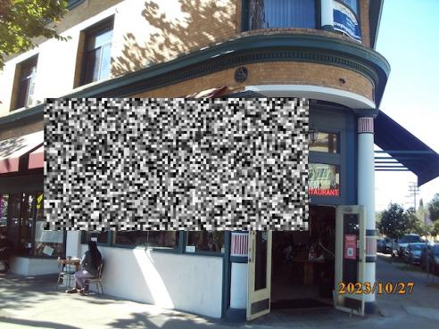

<a id="readme-top"></a>

<!-- PROJECT LOGO -->
<br />
<div align="center">
  
  <a href="https://github.com/github_username/repo_name">
    
  </a>
   

  <p align="center">
    Image editing, but wrong.
    <br />
    <a href="https://atypic.readthedocs.io/en/latest/#"><strong>Explore the docs »</strong></a>
    <br />
    <br />
  </p>
</div>


<!-- TABLE OF CONTENTS -->
<details>
  <summary>Table of Contents</summary>
  <ol>
    <li>
      <a href="#about-the-project">About The Project</a>
    </li>
    <li>
      <a href="#getting-started">Getting Started</a>
      <ul>
        <li><a href="#prerequisites">Prerequisites</a></li>
        <li><a href="#installation">Installation</a></li>
      </ul>
    </li>
    <li><a href="#usage">Usage</a></li>
    <li><a href="#license">License</a></li>
    <li><a href="#contact">Contact</a></li>
  </ol>
</details>


<!-- ABOUT THE PROJECT -->
## About The Project

This python library consists of an image editing platform, centered around atypic(al) effects. Choose from the built-in effects to apply and creates mask to apply them with.

<p align="right">(<a href="#readme-top">back to top</a>)</p>

<!-- GETTING STARTED -->
## Getting Started

### Prerequisites

Install dependencies:
```bash
pip install opencv-python numpy
```

---

### Installation

1. Clone the repo
   ```bash
   git clone https://github.com/github_username/repo_name.git
   cd atypic
   ```

2. Install the package
    ```bash
    pip install ./
    ```
<p align="right">(<a href="#readme-top">back to top</a>)</p>


<!-- USAGE EXAMPLES -->
## Usage

```python
import cv2
import matplotlib.pyplot as plt
import numpy as np
from atypic.effects import CorruptionEffect
from atypic.mask import Masker

frame = cv2.imread("input.jpg") #load image frame
masker = Masker(frame) #create blank mask
masker.create_rectangle_mask((0.1,0.3),(0.7,0.7))
corruption_effect = CorruptionEffect(frame, mask=masker.mask) #pass mask into effect initialization
edited_frame = corruption_effect.apply()
plt.axis("off")
plt.imshow(cv2.cvtColor(edited_frame, cv2.COLOR_BGR2RGB))
```

Input            |  Output
:-------------------------:|:-------------------------:
  |  


<p align="right">(<a href="#readme-top">back to top</a>)</p>


<!-- LICENSE -->
## License

Distributed under the MIT license. See `LICENSE.txt` for more information.

<p align="right">(<a href="#readme-top">back to top</a>)</p>


<!-- CONTACT -->
## Contact

Jared - jaredcasarez1@gmail.com

Project Link: [https://github.com/jaredcasarez/atypic](https://github.com/jaredcasarez/atypic)

<p align="right">(<a href="#readme-top">back to top</a>)</p>


<!-- MARKDOWN LINKS & IMAGES -->
<!-- https://www.markdownguide.org/basic-syntax/#reference-style-links -->

[license-shield]: https://img.shields.io/github/license/github_username/repo_name.svg?style=for-the-badge
[license-url]: https://github.com/github_username/repo_name/blob/master/LICENSE.txt
