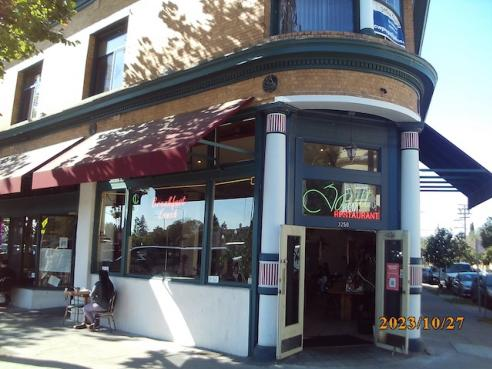

<p style="text-align: center;"> image editing, but wrong:</p>

</p>


---
## Getting Started
Install dependencies:
```bash
pip install opencv-python numpy
```

---
## Example Usage


```python
import cv2
import matplotlib.pyplot as plt
import numpy as np
from atypic.effects import CorruptionEffect
from atypic.mask import Masker

frame = cv2.imread("input.jpg") #load image frame
masker = Masker(frame) #create blank mask
masker.create_rectangle_mask((0.1,0.3),(0.7,0.7))
corruption_effect = CorruptionEffect(frame, mask=masker.mask)
edited_frame = corruption_effect.apply()
plt.axis("off")
plt.imshow(cv2.cvtColor(edited_frame, cv2.COLOR_BGR2RGB))
```

Input            |  Output
:-------------------------:|:-------------------------:
  |  
---
<details>
<summary></summary>

```python
import cv2
import numpy as np
import matplotlib.pyplot as plt
from atypic.effects import (
    RollPixelsEffect,
    RandomRollPixelsEffect,
    ColorValueEffect,
    ColorChannelSplitEffect,
    CorruptionEffect,
    SortEffect,
    ColorPaletteReductionEffect,
)
from atypic.mask import Masker

effects = [
    RollPixelsEffect,
    RandomRollPixelsEffect,
    ColorValueEffect,
    ColorChannelSplitEffect,
    CorruptionEffect,
    SortEffect,
    ColorPaletteReductionEffect,
]


masks = [
    lambda mask_obj: mask_obj.create_full_mask(),
    lambda mask_obj: mask_obj.create_circle_mask(center=(0.5, 0.5), radius=0.2),
    lambda mask_obj: mask_obj.create_ellipse_mask(
        center=(0.5, 0.5), axes=(0.3, 0.3), angle=45
    ),
    lambda mask_obj: mask_obj.create_polygon_mask(
        points=[(0.1, 0.1), (0.3, 0.2), (0.9, 0.7), (0.3, 0.4)]
    ),
    lambda mask_obj: mask_obj.create_rectangle_mask(
        top_left=(0.1, 0.1), bottom_right=(0.9, 0.9)
    ),
    lambda mask_obj: mask_obj.create_band_mask(
        orientation="horizontal", start=0.1, end=0.9
    ),
    lambda mask_obj: mask_obj.create_stripe_mask(
        orientation="vertical", stripe_width=0.1, gap=0.1
    ),
    lambda mask_obj: mask_obj.create_checkerboard_mask(block_size=0.25),
]


fig, ax = plt.subplots(len(masks), len(effects) + 2, figsize=(27, 22))
fig.subplots_adjust(
    left=0.01, right=0.99, top=0.99, bottom=0.01, hspace=0.1, wspace=0.0
)
for mask_num, (mask, ax) in enumerate(zip(masks, ax)):

    for axis in ax.flatten():
        axis.set_axis_off()
    frame = cv2.imread("test_input.jpg")
    masker = Masker(frame)
    mask(masker)
    ax[0].imshow(cv2.cvtColor(frame, cv2.COLOR_BGR2RGB))
    ax[0].set_title("Input frame", fontsize=24) if mask_num == 0 else ...
    ax[1].imshow(masker.mask, cmap="gray")
    ax[1].set_title("Effect mask", fontsize=24) if mask_num == 0 else ...
    for i, effect in enumerate(effects):
        effect_instance = effect(frame, mask=masker.mask)
        effect_out = effect_instance.apply()
        ax[i + 2].imshow(cv2.cvtColor(effect_out, cv2.COLOR_BGR2RGB))
        (
            ax[i + 2].set_title(effect.__name__.replace("Effect", ""), fontsize=24)
            if mask_num == 0
            else ...
        )
```
</details>


## License
MIT
